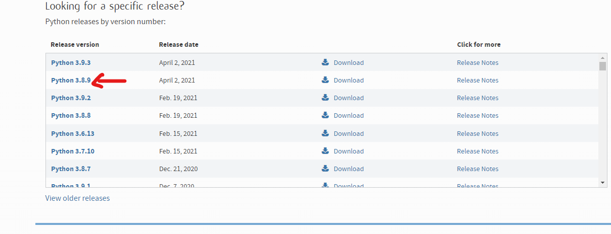

# **_OSU Local Infomation Get_**

## 在本地获取成绩的一个小小的.........py？😕 

##_目前只支持std，暂时不计划添加其他mode_

## 开发 ing🚀️ 

| 实现功能 | 状态 |
| --- | --- |
| 获取铺面信息|√|
| 获取玩家信息|ing  |
|获取最近游玩|ing|
|获取玩家bp|ing|
|最近游玩信息记录|ing|
|玩家信息变化记录|ing|
游玩信息以及玩家信息分析|ing|
|其他功能，想不起来，帮忙想想|欧内该！|

### 为什么要写它呢？🚀️ 

第一个是要学python  
第二个就是...给zh当参考  
嘛，不过归根到底就是自己写着玩  
万一真成有用的项目了呢😄   

挺耗时间的，有帮忙的可以帮个忙嘛各位大佬~~~  
最后要做到不需要账号，读取游戏数据，然后各种计算，完全本地不依靠ppy的（可能要另开）  
有大佬帮忙最好了Yeah  

顺便谢谢zh前期帮忙

### How - To - Use🚀️ 

1.安装python3.8   
网址：https://www.python.org/downloads/

2.打开终端安装所需要的库（安装方法百度）  
3.clone代码到本地  
4.使用python打开Firstuse.py设置基本信息  
5.使用其他功能  

### 目前需要的外置库
None...

### 如何获取相关信息🚀️ 
 
玩家id:  
打开自己的主页，网址最后的数字就是  
比如https://osu.ppy.sh/users/4504101  
4504101就是id  
.    
oauth：   
在自己个人资料的设置界面，下拉到最后  
创建新的oauth应用程序  
回调链接随意  
.  
铺面bid:  
知道铺面的网址，如https://osu.ppy.sh/beatmapsets/1250654#osu/2675038  
2675038就是bid  
如果是https://osu.ppy.sh/beatmapsets/1250654  
那么可以先复制到浏览器打开。  
1250654不是bid，那是sid  

### 开发时间线🚀️ 

2021.3.14计划开始  
2021.3.17第一次删库重写  
2021.3.27第二次删库重写  
2021.4.2定下最后的思路  
2021.4.3开始正式起步  
2021.4.4第一个功能上线~~~
......

### 求助计数🚀️

|求助人|次数|
|---|---|
|zh|8|
|kj|3|
|k3|1|
